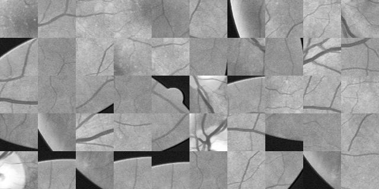
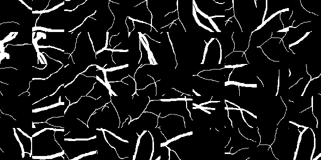

# Final-Year-Thesis-Retinal-Vessel-Segmentation-
This project is based on my final year thesis i.e. Retinal Vessel Segmentation using pytorch framework. This repository includes dataset preparation, data processing, training, testing, and visualization.

<p align="center">
  <b>..........................Retinal Image.............</b> <b>    Ground Truth Segmentation:</b> <b>    Predicted Segmentation Mask:</b> <br>   
  
  
  
</p>


## Table of Content
1. [Introduction](#introduction)
2. [Requirements](#requirements)
3. [Getting Started](#getting_started)
4. [Configuration](#config)
5. [Dataset Preparation](#dataset)
6. [Model Architecture](#model)
7. [Training](#training)
8. [Testing](#testing)
9. [Visualization](#visualization)
10. [Performance Metrics](#performance)
11. [Conclusion](#conclusion)

## 1. Introduction: <a name="introduction"></a>
Many severe eye-related disorders such as diabetic retinopathy, glaucoma, macular degeneration, etc are directly associated with the network of blood vessels present in the eyes. Hence, the study of these blood vessels can play a very crucial role during the diagnosis of diseases. The current clinical protocol of diagnosis includes manual inspection of fundus images by an ophthalmologist in order to extract relevant information and to look for pathologies. This process is extremely time-consuming and requires a lot of domain expertise. Computer-assisted diagnostic systems have shown promising results in the past in many related fields in Healthcare. Therefore, the primary goal of this project is to develop a Computer-Aided Diagnostic System using Deep Learning, which is capable of segmenting the blood vessels from the retinal fundus image, which can then be used by clinicians for follow-up diagnosis.


## 2. Requirements: <a name="requirements"></a>
It is highly recommended to first try using your current python environment. However, the following environment is successfully able to run the code.

```
Libraries                 Version

1.  python                 >= 3.5
2.  torch                  1.8.1
3.  torchvision            0.9.1
4.  tensorboardX           2.2
5.  argparse               1.1
6.  pandas                 1.1.5
7.  matplotlib             3.2.2
8.  opencv                 4.1.2
9.  numpy                  1.19.5
10. sklearn                0.22.2  
```

## 3. Getting Started: <a name="getting_started"></a>

### Installation
* Clone this repository by running the following command:
```
git clone git@github.com:sambittarai/Final-Year-Thesis-Retinal-Vessel-Segmentation-.git
cd Final-Year-Thesis-Retinal-Vessel-Segmentation
```
* Install Pytorch and its dependencies by running the following command: ``` pip install -r requirements.txt ```.

### Project Directory
```
Final-Year-Thesis-Retinal-Vessel-Segmentation       # Source code
    ├── README.md     # Readme file
    ├── config.py     # Configuration information
    ├── requirements.txt      # requirements
    ├── train.py      # training pipeline
    ├── test.py       # testing pipeline
    ├── Experiments
    ├── libraries
        ├── common.py
        ├── dataset.py
        ├── extract_patches.py
        ├── logger.py
        ├── metrics.py
        ├── pre_process.py
        ├── visualize.py
        ├── losses
            ├── loss.py
            ├── diff_loss_functions.py
    ├── models
        ├── DenseUnet.py
        ├── LadderNet.py
        ├── UNetFamily.py
    ├── prepare_dataset
        ├── data_path_list
        ├── chase_db1.py
        ├── drive.py
        ├── stare.py
    ├── tools
        ├── ablation
            ├── ablation_plot.py
            ├── ablation_plot_with_detail.py
        ├── visualization
            ├── preprocess_visualization.py
            ├── preprocessing_visualization.ipynb
```

## 4. Configuration: <a name="config"></a>

```
from config import parse_args

```

## 5. Dataset Preparation: <a name="dataset"></a>
* A total of 5 different publicly available retinal image datasets were used for experimentation purpose. Please download the datasets from the following official address: [DRIVE](https://drive.grand-challenge.org/), [STARE]( https://cecas.clemson.edu/~ahoover/stare/), [CHASE_DB1]( https://blogs.kingston.ac.uk/retinal/chasedb1/), [DIARET_DB1](http://www.it.lut.fi/project/imageret/diaretdb1/), [HRF]( https://www5.cs.fau.de/research/data/fundus-images/). These datasets consist of the retinal images, its manual segmentation, mask. We also used some proprietary dataset.

### Sample Patches

 

## 6. Model Architecture: <a name="model"></a>
* LadderNet


## 7. Training: <a name="training"></a>
* Update the config.py file according to your requirement and then run train.py file. 


## 8. Testing: <a name="testing"></a>

## 9. Visualization: <a name="visualization"></a>

## 10. Performance Metrics: <a name="performance"></a>

* Precision-Recall Curve


* ROC Curve


## 11. Conclusion: <a name="conclusion"></a>
